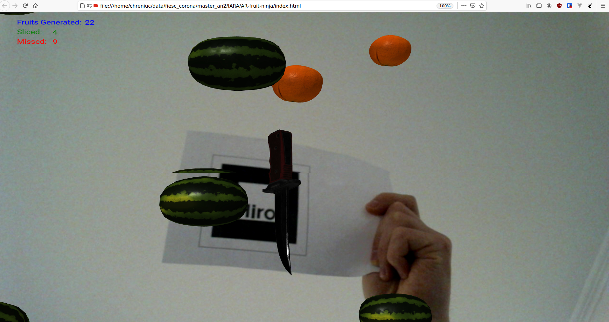

# AR-fruit-ninja

Using your webcam, this software identifies a marker and then it draws a knife(using the [aframe](https://aframe.io/) library). Afterwards fruts start to fall and the user should slice thouse fruits and try to slice as many as possible. If X(`GameOverLimitMissed`) fruits are not sliced, the game will stop and  a `GAME OVER` message will be printed.. If the user slices Y(`GameWinLimitSliced`) fruits, a `GAME WON` message will be printed. In both scenarios, there will be no more fruits generated.


## Demo



## How to use

Open the `index.html` in broswer without a http server.

Or start a http server:

```bash
cd AR-fruit-ninja
python3 -m http.server
```

Go to: `localhost:8000`

## Configurating the game

You can configurate the game by modifiying these config [options](js/config.js):

 - **intervalFruitGenrator** - Used to generate a random falling fruit at X milliseconds.
 - **intervalFallFactor** - The velocity of a falling fruit. This will be multiplicated by a random value generated between 3 - 6 seconds. The bigger this is the slower it will fall.
 - **GameOverLimitMissed** - When should the game stop? If the count of missed is this value, we will end the game.
 - **GameWinLimitSliced** - When should the game stop and notify the user that he/she won?
 - **NumberOfFruitGeneratedAtOnce** - When we generate falling fruits, how many should we generate at once?

## Add new fruit:

Adding a new fruit to this software is very simple, you just need to create a new entry in [this array](js/config.js), this array can be replaced with an api from a server that is conencted to a db.


## Sources used for implementing this project

 - [AR-product-info](https://github.com/chreniuc/AR-product-info)
 - [The Great Apples-Catch](https://github.com/Sebiee/catch-boxes)
 - Source of inspiration: https://medium.com/arjs/augmented-reality-in-10-lines-of-html-4e193ea9fdbf


## Models:

 - [Banana](https://sketchfab.com/3d-models/banana-3d-scan-c4f9b194abca4db7b4cd0ec6270f9d60)
 - [Orange](https://sketchfab.com/3d-models/fresh-orange-0896dc31d5154c97aa3f24e8ec1277aa)
 - [Watermelon](https://sketchfab.com/3d-models/watermelon-526d00c728a24311bfbec50bf54142ca)
 - [Knife](https://sketchfab.com/3d-models/knife-7746283c634c4855b7e2b08351ab44dd)

## Interesting improvements:

 - Show high score.
 - Restart the game without refreshing.
 - Increase the falling velocity(add levels) over time(or after X sliced fruits)